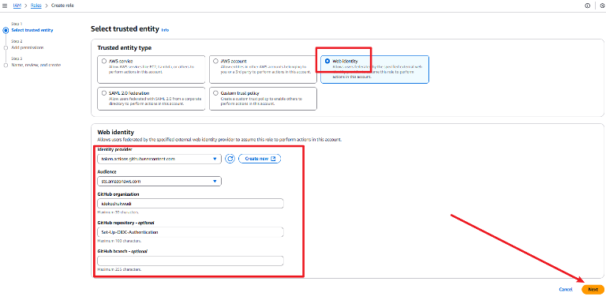
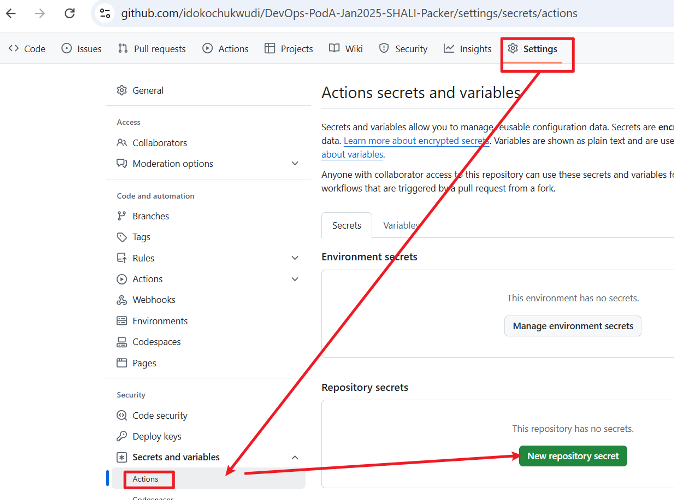

# Set-Up-OIDC-Authentication

## Introduction
In modern cloud environments, securely authenticating external identity providers (IdPs) without managing long-term credentials is essential. OpenID Connect (OIDC) authentication in AWS IAM allows services like GitHub Actions to assume IAM roles, enhancing security and simplifying access management. This guide walks through setting up OIDC authentication for AWS, including creating an IAM role and integrating it with GitHub Actions.

# Step 1: Set Up OIDC Authentication

OpenID Connect (OIDC) authentication allows AWS IAM roles to securely authenticate external identity providers (IdPs), such as GitHub Actions, Kubernetes, or Google Cloud, without storing long-term credentials.


## Actions:

1. Create an IAM Role for GitHub Actions
   - Go to AWS IAM → **Roles → Create Role**
   - Select Web Identity → **Choose OpenID Connect (OIDC)**
   - Set the Provider URL as For GitHub Actions:
   - Add audience: `sts.amazonaws.com`

    ```
    https://token.actions.githubusercontent.com
    ```

    

    

## Create an IAM Role for OIDC Authentication

1. Go to IAM Console → **Click “Roles” → Click “Create Role”.**
2. Select **“Web Identity”** as the trusted entity.
3. Choose the OIDC Provider you created earlier.
4. Specify the audience (for GitHub, use `sts.amazonaws.com`).



5. Attach policies:
   - AmazonEC2FullAccess (for AMI creation
   - IAMReadOnlyAccess (optional, for debugging)


6. Name the Role → Example: `GitHubOIDCDeploymentRole`


7. Copy the IAM Role ARN.


## Step 2: Update GitHub Actions Workflow

- Navigate to your repository where you need to update the GitHub Actions workflow.
- In GitHub, navigate to Settings → **Secrets and variables → Actions → New Repository Secret**



- **Secret Name:** `AWS_ROLE_ARN`
- **Value/Secret:** `(Paste the IAM Role ARN)`


## Conclusion
By setting up OIDC authentication, you enable secure and scalable access to AWS resources without relying on static credentials. This approach enhances security while simplifying identity management for GitHub Actions and other external providers. With the configured IAM role, your workflows can seamlessly authenticate and interact with AWS, ensuring efficient and secure deployments.
